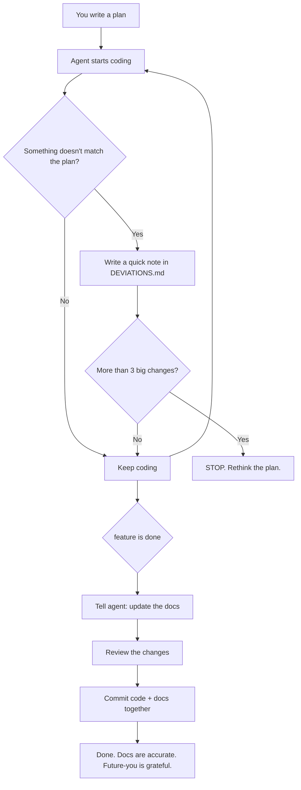

# Keeping Your Docs Alive
> A practical guide to never having outdated documentation again

---


## The Problem

You've been here before:

1. You write a plan.
2. You start coding.
3. Reality hits — things change.
4. You ship the feature.
5. The plan now describes a system that doesn't exist.
6. Three months later, someone (probably you) reads that plan and gets confused.

This workflow fixes that. It takes about 5 minutes of extra effort per feature.

---

## The Whole Flow, Visually




---

## The Big Idea (30-second version)

While your AI agent codes, it keeps a running log of anything it did differently
from the plan — like a pilot's flight log. When the feature is done, you tell the
agent to go back and update all the docs to match what was actually built.

That's it. That's the whole thing.

---

## How It Works, Step by Step

### Step 1: Before you start coding

Create a file called `docs/DEVIATIONS.md` in your project. Think of it as a
"things that changed" notepad. Put this template at the top:

```markdown
# What Changed During Implementation

<!-- Paste new entries below this line. Copy the format exactly. -->
```

Then, when you give your AI agent the coding task, add one extra line to
your prompt:

> "If you need to do something differently from the plan, jot down what
> changed and why in `docs/DEVIATIONS.md`, then keep going. Don't stop
> to ask me."

That's all the setup you need.

---

### Step 2: While the agent is coding

**You don't need to do anything.** Go grab coffee.

The agent will code normally. When it hits a snag — a library doesn't work
as expected, a better approach becomes obvious, the plan was unclear about
something — it writes a quick note in the log and keeps moving.

Each note looks something like this:

```markdown
## Switched from polling to WebSocket

- **What the plan said:** Check for new messages every 5 seconds
- **What I actually did:** Used a live WebSocket connection instead
- **Why:** Polling was too slow for a chat feature — 5 second delays felt broken
- **What this affects:** Added the `ws` library, added a WS_URL setting
```

No jargon. No ceremony. Just "what changed, and why."

---

### Step 3: The safety net — when to pull the brake

Here's the one rule you should care about:

> **If the agent logs more than 3 big changes, something is wrong with
> the plan itself.**

Tell your agent upfront:

> "If you find yourself making more than 3 major changes to the plan,
> stop and come talk to me. The plan probably needs a rewrite."

Small changes are fine and expected — renaming things, reordering steps,
picking a slightly different approach. But if the agent is rewriting your
database schema, swapping your API style, AND restructuring your folder
layout... that's not a deviation. That's a new plan. Stop and rethink.

---

### Step 4: After the feature works

This is the payoff. Once everything is working, give the agent one more job:

> "The feature is done. Now go update the docs:
>
> 1. Read through `docs/DEVIATIONS.md`.
> 2. Update the original plan to match what we actually built.
> 3. If we added any new settings, dependencies, or commands, make sure
>    the README and `.env.example` reflect that.
> 4. Archive the deviations log and start a fresh one for next time."

The agent will go through each change, update the relevant docs, and give
you a summary. Review it, make sure it looks right, and you're done.

---

### Step 5: Commit it all together

**This is important:** commit the doc updates in the same pull request as
the code. Not "I'll do it later." Not "in a separate ticket." Same PR.

```bash
git add src/                          # your code
git add docs/ README.md .env.example  # your updated docs
git commit -m "feat: add chat notifications (with doc sync)"
```

If the docs aren't in the PR, they won't get reviewed. If they don't get
reviewed, they'll be wrong. If they're wrong, they're worse than no docs
at all.

---

## A Quick Checklist for Your PRs

Before you hit merge, glance at this:

- [ ] Does the code work?
- [ ] Did I look at what changed vs. the plan?
- [ ] Does the plan doc now describe what was *actually* built?
- [ ] Are new settings / dependencies / commands documented somewhere?
- [ ] Is the deviations log cleaned up?

Tape this to your monitor until it becomes habit.

---

## How Much of This Do I Actually Need?

**If you're working alone:**
Keep it minimal. The deviations log + updating the plan is enough.
Skip the PR checklist — you don't need to review your own checkboxes.

**If you're on a small team (2–5 people):**
Use the full workflow. The deviations log is especially valuable here
because your teammates weren't in the room when things changed. The
log tells them *why* without a meeting.

**If you're on a bigger team:**
Add a "docs reviewer" role to your PR process. Someone skims the doc
changes and sanity-checks them. It takes 2 minutes and catches a lot.

---

## Common Questions

**Q: What if the agent forgets to log a deviation?**
It happens. The post-implementation sync step usually catches gaps,
because the agent will notice the code doesn't match the plan when
it's doing the update pass. It's not perfect, but it's much better
than relying on memory alone.

**Q: What counts as a "big" change vs. a small one?**
Rule of thumb: if someone reading the original plan would be
*surprised* by the change, it's big. If they'd shrug, it's small.

**Q: Do I need to read every deviation entry?**
Skim them. Most will be boring ("used a different function name").
You're looking for the ones that say "changed the database" or
"added a new dependency" — the stuff that affects other people.

**Q: What if I'm not using an AI agent? Can I use this myself?**
Absolutely. The workflow works just as well for human developers.
Keep a scratch note while you code, then reconcile at the end.
The format doesn't matter as long as you capture what/why/impact.

**Q: This seems like extra work.**
It's about 5 minutes per feature. Compare that to the 2 hours you'll
spend three months from now trying to figure out why the code doesn't
match the docs. It's an investment that pays off fast.

---

